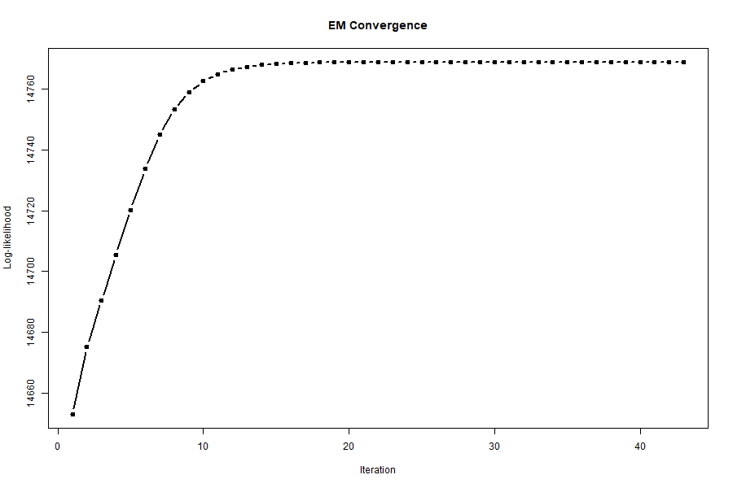
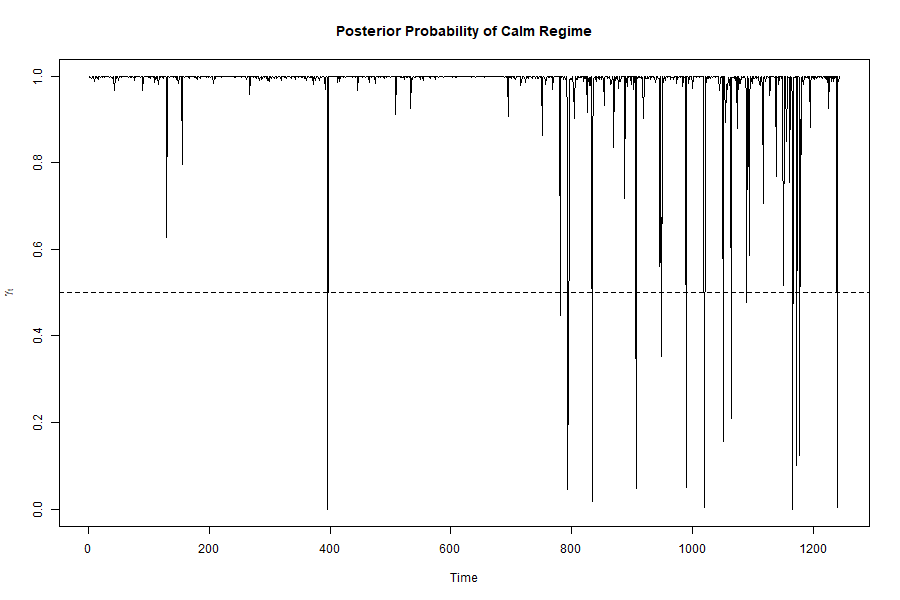
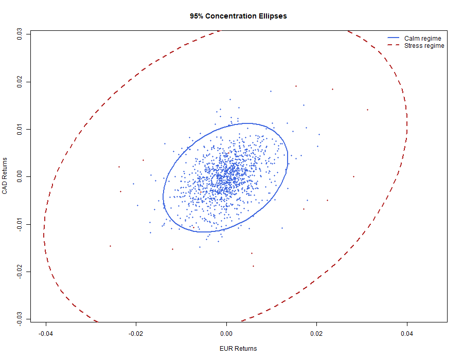

# FX Risk Modeling with Gaussian Mixture Model (EM Algorithm)

## Overview

This project implements a multivariate Gaussian mixture model estimated via the Expectation-Maximization (EM) algorithm to model foreign exchange (FX) returns. It captures regime-switching behavior (calm vs stress) and evaluates risk using Value-at-Risk (VaR).

---

## Objectives

- Model FX returns using a two-regime Gaussian mixture  
- Estimate parameters using the EM algorithm  
- Identify calm vs stress regimes  
- Compute Value-at-Risk (VaR)  
- Compare with a more flexible Generalized Hyperbolic (GH) distribution  

---

## Project Structure

```
scripts/
    01_download_data.R
    02_prepare_returns.R
    03_em_algorithm.R
    04_var_analysis.R
    05_gh_comparison.R
    06_run_project.R

data/
figures/
report/
```

---

## Methodology

- **Data**: FX daily returns (EUR/USD, CAD/USD, GBP/USD)  
- **Model**: Gaussian mixture (2 regimes)  
- **Estimation**: EM algorithm  
- **Risk measure**: Value-at-Risk (Monte Carlo simulation)  
- **Benchmark**: GH distribution  

---

## Results

- Clear separation between low and high volatility regimes  
- EM algorithm converges quickly  
- VaR captures extreme risk scenarios  
- GH model provides better tail fit than Gaussian mixture  

---

## Visual Results

### EM Convergence


### Regime Probabilities


### Regime Ellipses


---

## How to Run

```r
source("scripts/06_run_project.R")
```
Author

Abdoul Sarr